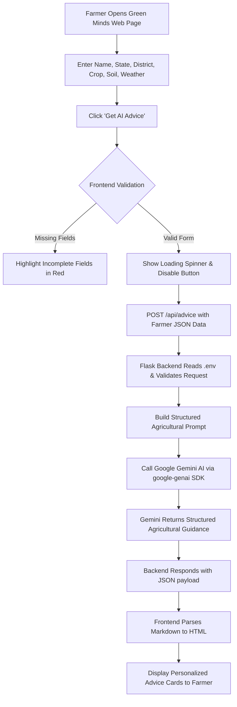
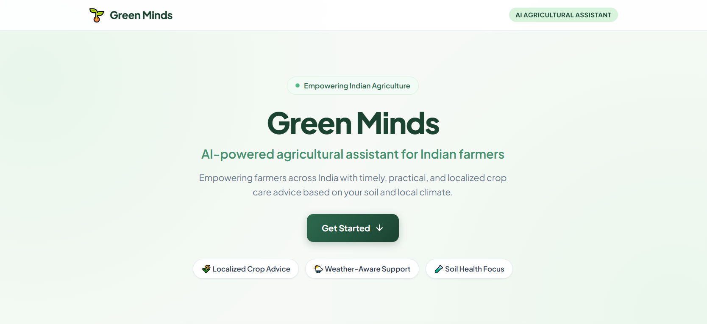
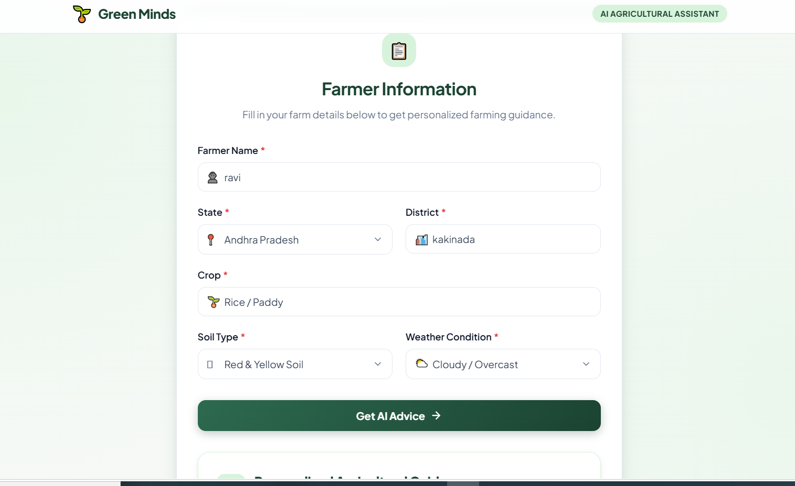
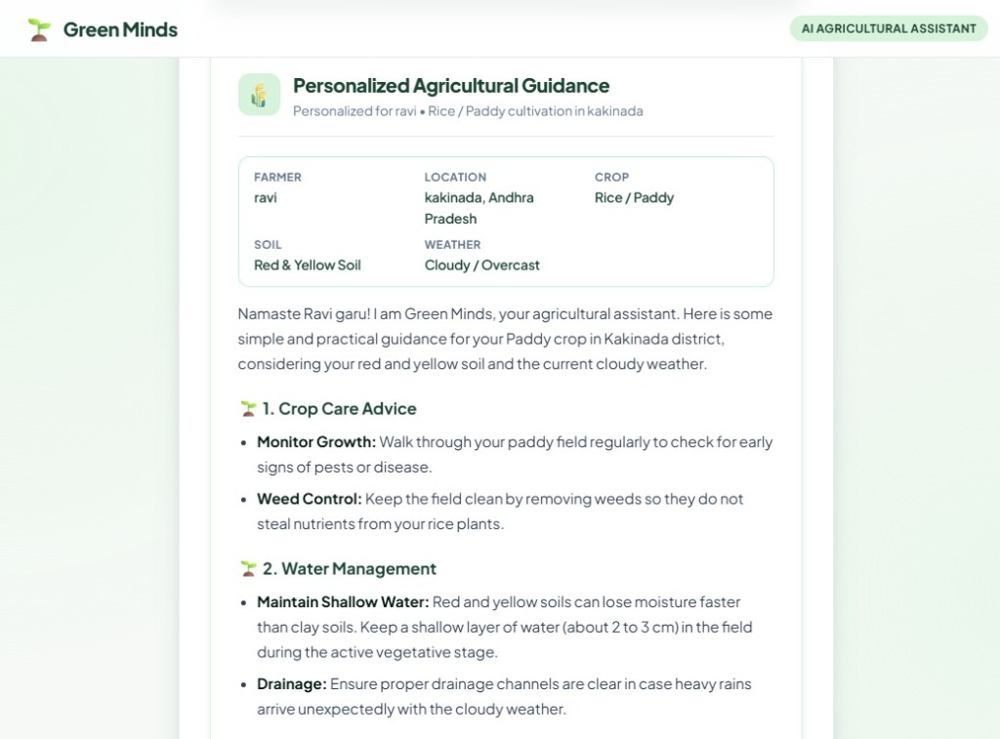
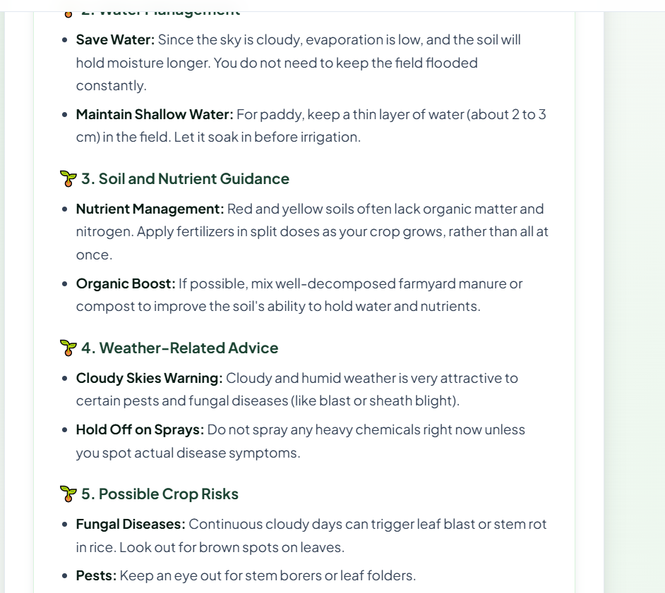
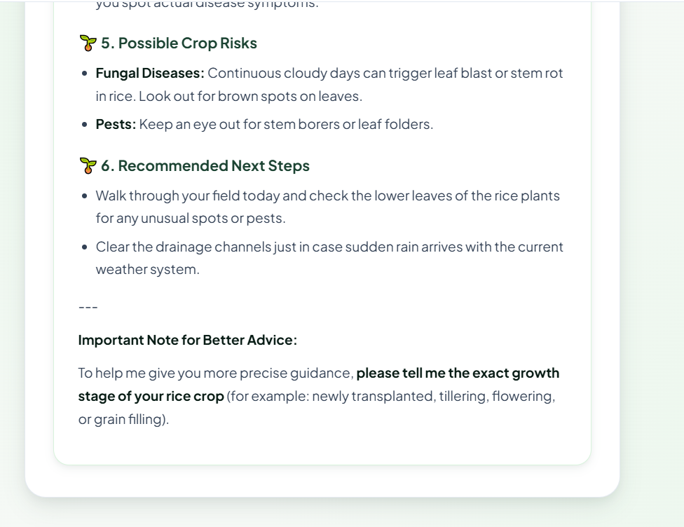
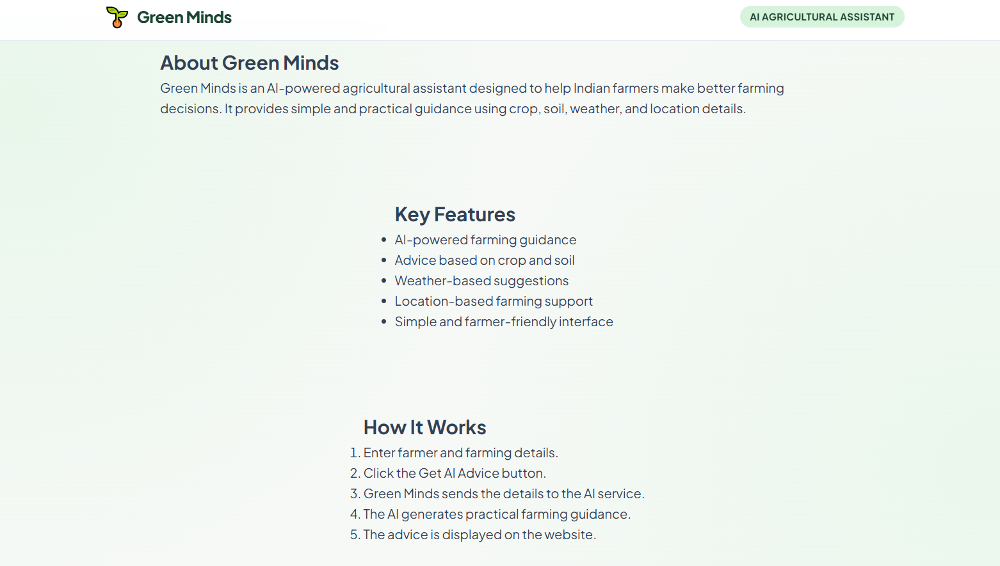

# 🌱 Green Minds

> **Project Tagline:** AI-powered agricultural assistant for Indian farmers  
> **Team:** Agri Innovator  
> **Repository:** [https://github.com/25A31A0575/GreenMinds](https://github.com/25A31A0575/GreenMinds)

---

## 1. Project Overview

**Green Minds** is an AI-powered agricultural web assistant designed to empower Indian farmers with timely, practical, and localized crop guidance. Agriculture in India is deeply tied to regional soil diversity, seasonal weather patterns, and specific crop requirements. However, many farmers face challenges accessing tailored agricultural extension advice at the right time.

Green Minds bridges this gap by offering a clean, simple, and accessible interface where farmers or agricultural extension workers can enter key parameters—including location (State and District), current Crop, Soil Type, and prevailing Weather Conditions. Green Minds communicates with an intelligent AI backend powered by Google Gemini to produce structured, actionable, and safety-conscious recommendations.

---

## 2. Problem Statement

Indian agriculture supports over half of the country's population, yet farmers frequently encounter:
* **Information Fragmentation:** General weather reports or generic agricultural advice often fail to consider the exact crop and local soil conditions simultaneously.
* **Lack of Timely Guidance:** When unexpected weather shifts occur (e.g., sudden cloudy spells, unseasonal dry periods), obtaining rapid guidance on irrigation and pest management is difficult.
* **Complex Terminology:** Scientific agricultural documentation is often too technical or difficult to navigate for everyday farm decision-making.
* **Risk of Over-treatment:** In the absence of timely advice, farmers may apply excessive or inappropriate chemical treatments, increasing costs and damaging soil health.

---

## 3. Solution

Green Minds provides an easy-to-use digital assistant that delivers localized agricultural advice in seconds:
* **Context-Aware Recommendations:** Combines farmer identity, geography (state & district), crop type, soil variety, and immediate weather conditions into a unified prompt.
* **Actionable Advice Categories:** Organizes advice into clear, practical sections: crop care, water management, soil nutrients, weather cautions, crop risks, and immediate next steps.
* **Safety & Best Practices:** Specifically instructed to avoid unsafe chemical suggestions and emphasize organic enhancements and practical field management.
* **Accessible Interface:** Built with a clean, mobile-responsive layout that runs seamlessly on smartphones and desktop browsers alike.

---

## 4. Key Features

Only features genuinely implemented in the codebase are listed below:

* **Farmer Information Input:**
  * Farmer Name field with autocomplete support.
  * State selector dropdown covering all 28 Indian States and Union Territories.
  * District text input for localized district-level recommendations.
  * Crop input with automated datalist suggestions (Rice/Paddy, Wheat, Cotton, Sugarcane, Maize, Mustard, Soybean, Gram, Millets, Groundnut, Tomato, Potato, Onion, etc.).
  * Soil Type dropdown (Alluvial Soil, Black Soil / Regur, Red & Yellow Soil, Laterite Soil, Clayey Soil, Sandy / Arid Soil, Loamy Soil, Mountain / Forest Soil).
  * Weather Condition dropdown (Sunny / Clear, Hot & Dry, Humid / Warm, Cloudy / Overcast, Rainy / Monsoon, Cold / Winter Frost).
* **Get AI Advice Action:** One-click submission that triggers asynchronous backend processing.
* **Client-Side Form Validation:** Real-time visual feedback that highlights empty or invalid fields and guides the user.
* **Interactive Loading State:** Visual spinner and helpful status messages while the AI generates advice.
* **Personalized AI Advice Presentation:**
  * Summary status chips displaying the farmer's name, location, crop, soil, and weather.
  * Formatted output rendering markdown headings, bold text, numbered lists, and bullet points into styled HTML.
  * Clear sectioning (Crop Care, Water Management, Soil & Nutrients, Weather Precautions, Crop Risks, and Recommended Next Steps).
* **Robust Error Handling:** Dedicated error banner providing user-friendly recovery instructions if the server or API key is unavailable.
* **Mobile-Responsive Design:** Fully responsive layout with custom CSS breakpoints for seamless usage on smartphones and tablets.
* **Backend Health Check Endpoint:** Live status indicator at the server root (`/`) confirming server health and API key configuration.
* **Cross-Platform Console Compatibility:** Native UTF-8 stream reconfiguration preventing Windows console encoding errors when printing status emojis.
* **Automated Multi-Scenario Test Suite:** Pre-configured automated regression suite testing regional diversity, extreme weather, and edge cases.

---

## 5. Technologies Used

### Frontend
* **HTML5:** Semantic markup structure including forms, sections, and accessibility labels.
* **CSS3:** Custom responsive styling, CSS custom properties (variables), modern card layouts, flexbox, and CSS grid.
* **JavaScript (Vanilla ES6+):** Asynchronous `fetch()` API, client-side input validation, dynamic DOM rendering, and custom markdown-to-HTML parser.
* **Google Fonts:** Plus Jakarta Sans typography.

### Backend
* **Python 3:** Core programming language.
* **Flask:** Lightweight WSGI web application framework serving API endpoints.
* **Flask-CORS:** Cross-Origin Resource Sharing handling between frontend and backend.
* **Gunicorn:** Production-grade WSGI HTTP server for scalable deployment.
* **python-dotenv:** Secure management of environment variables without leaking credentials.

### AI & Cloud
* **Google Gemini API (`google-genai` SDK):** Generative AI reasoning utilizing models such as `gemini-flash-latest`, with built-in fallback resilience across `gemini-2.5-flash-lite` and `gemini-3.6-flash`.

---

## 6. Project Structure

```text
GreenMinds/
│
├── .env.example                     # Environment variables template (safe for Git)
├── .gitignore                       # Git ignore file protecting .env and cache
├── index.html                       # Frontend application markup & landing page
├── style.css                        # Design system, theme colors, and responsive CSS
├── script.js                        # Frontend logic, validation, API call, and markdown parser
├── server.py                        # Flask backend server connecting to Gemini API
├── requirements.txt                 # Python dependencies list (Flask, CORS, GenAI, Gunicorn)
├── GreenMinds_AI_Prompt.txt         # Master AI prompt template guiding Gemini
├── test_scenarios.py                # Automated end-to-end multi-scenario test suite
│
├── Day3_Testing_Result.txt          # Day 3 hackathon test logs
├── Day6_Testing_Result.txt.txt      # Day 6 hackathon verification logs
├── Additional_Testing_Results.txt   # Comprehensive automated test suite results
├── GreenMinds_Demo_Script.txt.txt   # Presentation and demo script for judges
├── GreenMinds_Project_Description.txt.txt # Hackathon project description
├── README.md                        # Complete project documentation
│
└── screenshots/                     # Visual evidence and application screenshots
    ├── 01_Hero_Section.png          # Landing page hero section & feature pills
    ├── 02_Farmer_Information_Form.png # Completed farmer details input form
    ├── 03_AI_Advice_Result_Part1.png # AI guidance: Summary tags & crop care
    ├── 04_AI_Advice_Result_Part2.png # AI guidance: Soil nutrients & weather advice
    ├── 05_AI_Advice_Result_Part3.png # AI guidance: Crop risks & next steps
    └── 06_About_and_Key_Features.png # Informational footer sections & features
```

### Purpose of Core Files
* **`index.html`**: Contains the complete single-page interface: header navigation, hero banner, interactive farmer input form, loading indicator, error display, and advice container.
* **`style.css`**: Defines the agricultural visual theme (forest greens, mint accents, soft neutrals), input focus states, responsive typography, and mobile-friendly media queries.
* **`script.js`**: Listens for form events, performs validation on every field, sends a POST request with the farmer payload to Flask, and dynamically parses and renders the AI Markdown advice into clean HTML.
* **`server.py`**: The Flask application entry point. Implements CORS, reads `.env`, builds the agricultural prompt, and contacts the Google Gemini API with fallback model redundancy.
* **`requirements.txt`**: Specifies exact Python library versions required to run the backend in development and production (with Gunicorn).
* **`GreenMinds_AI_Prompt.txt`**: Outlines the guidelines given to Gemini, requiring safe, localized, and practical agricultural recommendations.
* **`test_scenarios.py`**: Automated test suite executing 6 end-to-end agricultural scenarios, input validations, and error resilience checks.
* **`Additional_Testing_Results.txt`**: Detailed execution log verifying 100% pass rate across multiple Indian regions, crops, and edge cases.

---

## 7. How the Application Works

The complete end-to-end user flow:



1. **User Opens Green Minds**: The user accesses `index.html` locally or through a local server.
2. **Farmer Data Entry**: The user fills in their name, selects their state, inputs district, chooses/types a crop, chooses soil type, and picks current weather.
3. **Form Submission**: The user clicks **Get AI Advice**.
4. **Client-Side Validation**: `script.js` validates that all required fields are filled. If any field is missing, it highlights the field and focuses it.
5. **API Call**: If valid, the loading spinner appears, and `script.js` sends a `POST` request with a JSON payload to `http://localhost:5000/api/advice`.
6. **Backend Processing**: `server.py` verifies the API key and constructs a localized agricultural prompt following the guidelines in `GreenMinds_AI_Prompt.txt`.
7. **Gemini AI Generation**: The backend invokes Google Gemini via the `google-genai` SDK with fallback model support.
8. **Advice Display**: The frontend receives the response, converts the Markdown text into formatted HTML sections, displays summary metadata chips, and smoothly scrolls to the results.

---

## 8. Backend

The backend is built with Python and **Flask**, serving as a secure gateway between the web frontend and Google Gemini.

### API Routes

#### 1. Health Check
* **Endpoint:** `GET /`
* **Purpose:** Checks whether the backend server is running and whether `GEMINI_API_KEY` is loaded.
* **Sample Response:**
```json
{
  "status": "online",
  "service": "Green Minds Backend",
  "apiKeyConfigured": true,
  "message": "Backend server is running smoothly!"
}
```

#### 2. Get Agricultural Advice
* **Endpoint:** `POST /api/advice`
* **Purpose:** Accepts farmer inputs, builds prompt, queries Gemini AI, and returns agricultural guidance.
* **Request Headers:** `Content-Type: application/json`
* **Request Body Example:**
```json
{
  "name": "Ravi",
  "state": "Andhra Pradesh",
  "district": "Kakinada",
  "crop": "Rice / Paddy",
  "soilType": "Red & Yellow Soil",
  "weatherCondition": "Cloudy / Overcast"
}
```
* **Success Response (200 OK):**
```json
{
  "success": true,
  "farmerName": "Ravi",
  "advice": "Namaste Ravi! I am Green Minds, your farming assistant..."
}
```
* **Error Response (400 / 500):**
```json
{
  "success": false,
  "error": "Error description or missing configuration"
}
```

---

## 9. AI Integration

* **SDK:** `google-genai` (official Google GenAI Python SDK).
* **Model Pipeline:** `server.py` implements a resilient multi-model fallback strategy:
  1. `os.getenv("GEMINI_MODEL", "gemini-flash-latest")`
  2. `gemini-2.5-flash-lite`
  3. `gemini-3.6-flash`
* **Prompt Engineering:** The prompt injects the farmer's specific parameters into a structured template requiring:
  1. Crop care advice
  2. Water management
  3. Soil and nutrient guidance
  4. Weather-related advice
  5. Possible crop risks
  6. Recommended next steps
* **Safety Instruction:** Gemini is explicitly instructed:
  > *"Avoid making unsafe or highly specific chemical recommendations. If important information is missing, clearly say what information is needed."*
* **Security:** The Gemini API key is loaded strictly on the backend using `python-dotenv`. It is never exposed to the frontend or sent to the browser.

---

## 10. Environment Variables

Sensitive credentials such as API keys are stored in a local `.env` file that is excluded from version control via `.gitignore`.

An environment template file named `.env.example` is provided in the repository:

```env
# ==============================================================================
# Green Minds - Environment Variables Template
# 
# INSTRUCTIONS:
# 1. Create a file named `.env` in this same folder.
# 2. Copy the line below into your `.env` file.
# 3. Replace "your_actual_gemini_api_key_here" with your actual Gemini key from Google AI Studio.
# 4. NEVER commit or share your `.env` file.
# ==============================================================================

GEMINI_API_KEY=your_actual_gemini_api_key_here
PORT=5000
```

> **Security Note:** Never commit your actual `.env` file or API keys to GitHub. Keep `.env` listed in `.gitignore`.

---

## 11. Installation and Setup

Follow these beginner-friendly steps to set up the project on your local machine:

### Prerequisites
* **Python 3.10+** installed on your system.
* A free Gemini API key from [Google AI Studio](https://aistudio.google.com/).
* A modern web browser (Google Chrome, Edge, Firefox, etc.).

### Step 1: Clone the Repository
```bash
git clone https://github.com/25A31A0575/GreenMinds.git
cd GreenMinds
```

### Step 2: Install Python Dependencies
Open your terminal inside the `GreenMinds` folder and run:
```bash
pip install -r requirements.txt
```

### Step 3: Configure Your API Key
1. In the project folder, make a copy of `.env.example` and name it `.env`:
   * On Windows (PowerShell):
     ```powershell
     Copy-Item .env.example .env
     ```
   * On Linux / macOS:
     ```bash
     cp .env.example .env
     ```
2. Open `.env` in any text editor and replace `your_actual_gemini_api_key_here` with your actual Google Gemini API key:
   ```env
   GEMINI_API_KEY=AIzaSy...your_real_key...
   PORT=5000
   ```

---

## 12. Running the Project

### Step 1: Start the Backend Server
In your terminal, run:
```bash
python server.py
```
You will see:
```text
🌱 Green Minds backend starting on http://localhost:5000
 * Running on http://127.0.0.1:5000
```
You can verify the backend is running by opening `http://localhost:5000` in your browser.

### Step 2: Open the Web Application
Double-click `index.html` to open it in your browser, or start a lightweight local web server in a second terminal:
```bash
python -m http.server 8000
```
Then visit `http://localhost:8000` in your web browser.

### Step 3: Test the AI Advice
1. Enter a Farmer Name (e.g., `Ravi`).
2. Select your State (e.g., `Andhra Pradesh`).
3. Enter your District (e.g., `Kakinada`).
4. Enter or choose your Crop (e.g., `Rice / Paddy`).
5. Select your Soil Type (e.g., `Red & Yellow Soil`).
6. Select current Weather Condition (e.g., `Cloudy / Overcast`).
7. Click **"Get AI Advice"** and review the personalized guidance!

### Step 4: Run the Automated Multi-Scenario Test Suite
To verify the full end-to-end AI pipeline across diverse regional contexts, run:
```bash
python test_scenarios.py
```
This executes automated integration tests against the live backend, validating response schema, cultural greetings, weather precautions, and error handling.

### Step 5: Production Deployment with Gunicorn (Optional)
For production environments (e.g., Render, Railway, or Linux VPS), run the WSGI server:
```bash
gunicorn -w 4 -b 0.0.0.0:5000 server:app
```

---

## 13. Screenshots / Project Evidence

Below are actual screenshots demonstrating the implemented Green Minds application.

### Main Interface & Farmer Input

#### Hero Section & Application Overview
Displays the brand title, mission banner, feature pills, and "Get Started" call-to-action button.



#### Farmer Information Form
Interactive input form with localized dropdowns for Indian states, districts, crops, soil varieties, and current weather.



---

### AI Agricultural Advice Generation

#### Personalized Advice: Summary & Crop Care
Shows the metadata chips confirming farmer details, followed by tailored Crop Care Advice and Water Management recommendations.



#### Personalized Advice: Soil Health & Weather Adaptations
Details soil nutrient management strategies for specific soil types and actionable weather cautions for cloudy conditions.



#### Personalized Advice: Crop Risks & Recommended Next Steps
Outlines potential pest and fungal risks along with concrete next steps for the farmer in the field.



---

### Project Information & Workflow

#### About, Features & How It Works
Informational sections detailing the project objectives, core feature capabilities, and end-to-end workflow.



---

## 14. Verification & Testing

The core functionality of Green Minds has been extensively verified:
* **Day 3 Testing**: Form submission, AI response generation, and frontend display verified (Status: **PASS**).
* **Day 6 Testing**: Backend server connectivity, multi-field validation, and Gemini AI response readability verified (Status: **PASS**).
* **Automated Multi-Scenario Test Suite (`test_scenarios.py`)**: 6 out of 6 end-to-end tests passed (**100% PASS**). Full logs recorded in `Additional_Testing_Results.txt`.

### Automated Scenario Test Results

| # | Test Scenario | Farmer & Region | Tested Parameters | HTTP Status | Response Time | AI Advice Length | Verification Result |
|---|---|---|---|---|---|---|---|
| **1** | **Health Check** | System Root | `GET /` | `200 OK` | 0.02s | JSON status | ✅ **PASS** — Confirmed service online & Gemini API key configured. |
| **2** | **Monsoon Rice** | Lakshmi Devi (East Godavari, AP) | Rice / Alluvial / Rainy Monsoon | `200 OK` | 10.38s | 2,740 chars | ✅ **PASS** — Authentic greeting (*"Lakshmi Devi garu"*), drainage channels, blast disease alerts. |
| **3** | **Semi-Arid Cotton** | Vijay Shinde (Yavatmal, MH) | Cotton / Black Soil / Hot & Dry | `200 OK` | 32.52s | 2,588 chars | ✅ **PASS** — Localized greeting (*"Vijay Shinde ji"*), boll shedding protection, soil cracking prevention. |
| **4** | **Winter Frost Mustard** | Gurpreet Singh (Ludhiana, PB) | Mustard / Loamy / Cold Winter Frost | `200 OK` | 15.27s | 2,576 chars | ✅ **PASS** — Punjabi greeting (*"Sat Sri Akal, Gurpreet Singh ji"*), light night irrigation, aphid control. |
| **5** | **Empty Payload Edge Case** | System | Empty `{}` to `POST /api/advice` | `400 Bad Request` | 0.01s | Error JSON | ✅ **PASS** — Clean validation error message preventing server crash. |
| **6** | **Partial Data Resilience** | Anil Sharma (Rajasthan) | Name & State only (Missing crop/soil/weather) | `200 OK` | 15.14s | 2,299 chars | ✅ **PASS** — Gracefully identifies missing details and politely asks what is needed. |

---

## 15. License & Acknowledgments

* **License:** Developed for academic and hackathon demonstration purposes.
* **Team:** Agri Innovator
* **AI Provider:** Google Gemini API